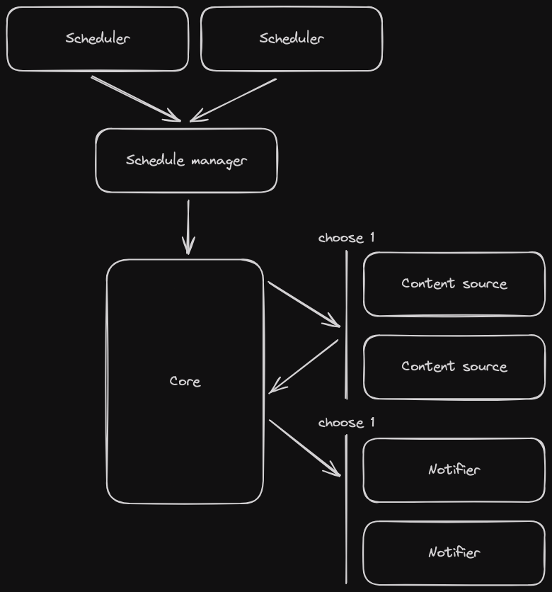

# Aviary - orchestrator for scheduling notifications

Aviary is a general-purposed notification orchestration library that uses a plugin architecture to allow for a modular approach to scheduling, fetching/generating and notifying of (personalized) content.

## Documentation

Core concepts/plugin types:

- **Scheduler** - Creates requests for scheduling, usually user(s) and a timestamp
- **(Schedule/Schedule manager)** - Processes the scheduling requests and triggers the rest of the pipeline (requesting content and sending the notification) on time
- **Content Source** - Fetches or generates content for notifications
- **Notifier** - Delivers the notifications to the intended recipient

Here is a basic showcase of how the library works:

```ts
const aviary = Aviary.builder()
  // Designate users which should get a notification
  .addScheduler({
    async *run() {
      yield { data: "user1", date: new Date("2024-08-24 07:00") }; // Once at a specific time
      while (true) {
        // Every minute at the current time
        yield { data: "user2", date: new Date() };
        sleep(60000);
      }
    },
  })
  .addContentSource({
    async getContent(data) {
      // Fetch (personalized) content for a specific data
      const response = await fetch(`https://content.example.com/data/${data}`);
      const data = await response.json();
      return data.content;
    },
  })
  .addNotifier({
    async notify(data, content) {
      // Notify the data
      await fetch("https://notification.example.com/send", {
        method: "POST",
        headers: { "Content-Type": "application/json" },
        body: JSON.stringify({ to: data, message: content }),
      });
    },
  })
  .build();

await aviary.run();
```

Though more realistically, you will be using existing or custom plugins:

```ts
Aviary.builder()
  .addScheduler(new CronScheduler("0 7 * * *")) // Every day at 7:00
  .addScheduler(new WebhookScheduler()) // Or on demand
  .addContentSource(new PersonalizedContentSource())
  .addNotifier(new EmailNotifier())
  .run();
```

Aviary has a default implementation of a schedule manager, which can be used when the shape of scheduling requests is `{ data: T, date: Date }`.



<!-- TODO: More detailed documentation:

- Multiple schedulers
- Multiple content sources
- Multiple notifiers, channels
- Custom Schedule Manager
- Error handling -->

### Plugins

Aviary provides some plugins with the most used functionality or as a starting point/reference for creating custom plugins, located in `packages/plugins`.

- Ready-to-use plugins:

  - `periodic-scheduler`: Uses a [cron expression](https://en.wikipedia.org/wiki/Cron) to periodically run a callback which returns scheduling requests
  - `webhook-scheduler`: Opens a webhook for scheduling notifications on demand
  - `kafka-scheduler`: Connects to and listens on a Kafka topic for scheduling requests
  - `cron-scheduler`: Schedules all specified users using a [cron expression](https://en.wikipedia.org/wiki/Cron)

- Example plugins: To illustrate/help with the process of creating own plugins, we provide several very simple example plugins:
  - `vanilla-cron-scheduler`: Showcase of how to handle scheduling using async generator functions in plain JS
  - `simple-cron-scheduler`: A more idiomatic version of the `vanilla-cron-scheduler` using the utility class `AsyncQueue` from `@aviaryjs/core`, which greatly improves developer expericence when working with async generator functions

### Examples

This monorepo includes examples of complete integrations of Aviary in `packages/examples`:

<!-- TODO simple example -->

- `channels-example`: An example usage of multiple notifiers and channels (uses `webhook-scheduler`)

All examples can be run by installing dependencies `bun install` and executing `bun start` in the their respective directories.

## Development

This library uses [Bun](https://bun.sh/) for development.

To install dependencies:

```bash
bun install
```
